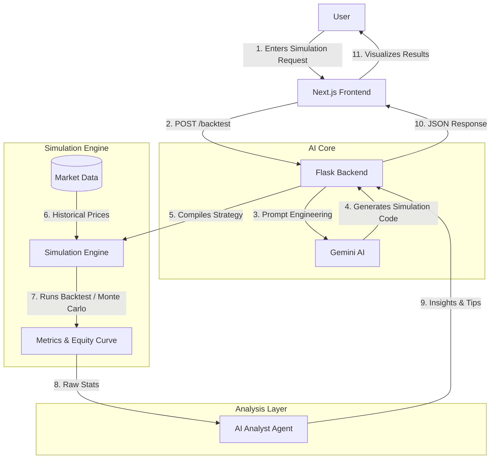

# FinSim 🚀  
### **The Intelligent Financial Simulation Engine**  
**Hack This Fall 2025 Submission by Team *brnch***

---

 


## 📖 Introduction

**FinSim** is a comprehensive **financial simulation platform** designed to bridge the gap between complex quantitative analysis and everyday investors. 

Financial markets are dynamic and unpredictable. Testing a trading idea usually requires advanced Python skills to build rigorous simulations. **FinSim changes that.** We allow anyone to describe a trading strategy or market scenario in **plain English**, and our AI agent instantly converts it into executable code.

We don't just "backtest"—we **simulate**. Whether it's validating a strategy against historical data or running stress tests, FinSim provides the tools to understand market behavior without writing a single line of code.

> **"If you can speak it, you can simulate it."**

---

## 🌟 Key Features (USP)

### 🗣️ **English-to-Simulation Engine**
This is the core of FinSim. We treat simulations as a language problem.
1.  **You type:** *"Buy Apple stock when the RSI is below 30 and price is above the 200-day moving average. Run a Monte Carlo simulation to stress test this."*
2.  **FinSim acts:**
    *   **Translates** your text into a robust Python simulation strategy.
    *   **Fetches** high-fidelity historical market data.
    *   **Executes** the simulation (Backtesting, Monte Carlo, etc.) to validate performance across different market conditions.
    *   **Reports** Profit/Loss, Win Rate, Drawdowns, and probabilistic outcomes.

### 🧠 **AI-Powered Analysis**
We don't just dump numbers on you. An AI Agent reviews your simulation results and provides:
*   **Verification:** Was this actually a robust strategy, or did you just get lucky?
*   **Recommendations:** Actionable tips to improve your strategy (e.g., "Try tightening your stop-loss to reduce drawdown").

### 📚 **Agentic RAG (Financial Search)**
An advanced search engine that lets you query financial documents and verified stock data to get accurate, sourced answers before you design your simulation.

---

## 🛠️ Architecture & Tech Stack

FinSim is built as a modern, high-performance web application.

### **The Stack**
*   **Frontend:** [Next.js](https://nextjs.org/) (React) with Tailwind CSS & Shadcn UI for a beautiful, responsive dashboard.
*   **Backend:** [Flask](https://flask.palletsprojects.com/) (Python) serving as the orchestration layer.
*   **AI Intelligence:** [Google Gemini](https://deepmind.google/technologies/gemini/) (Pro & Flash models) for code generation and data analysis.
*   **Data Engine:** `yfinance` for market data, `backtesting.py` for simulation logic, and `Qdrant` for vector search.

### **System Flow**



---

## 🚀 Getting Started

To run FinSim locally, follow these steps:

### Prerequisites
*   Node.js (v18+)
*   Python (v3.9+)
*   Google Gemini API Key

### Installation

1.  **Clone the repo**
    ```bash
    git clone https://github.com/your-repo/finsim.git
    cd finsim
    ```

2.  **Backend Setup**
    ```bash
    cd backend
    python -m venv .venv
    source .venv/bin/activate  # or .venv\Scripts\activate on Windows
    pip install -r requirements.txt
    
    # Create .env file and add your GOOGLE_API_KEY
    echo "GOOGLE_API_KEY=your_key_here" > .env
    
    python run.py
    ```

3.  **Frontend Setup**
    ```bash
    cd ../frontend/apps/trader
    pnpm install
    pnpm dev
    ```

4.  **Open your browser** to `http://localhost:3000`

---

## ⚠️ Disclaimer

**FinSim is a hackathon project created for educational and demonstration purposes only.**

*   We are **not** financial advisors.
*   The simulations and AI insights provided by this tool should **never** be taken as financial advice.
*   Simulations are based on historical data and do not guarantee future performance.
*   Trading stocks involves risk, and you can lose money. Always do your own research.

---

### Team *brnch*
*   **Ayush Bohra** - AI & ML
*   **Pradyut Das** - Full Stack
*   **Rishabh Jain** - Cloud & DevOps

*Built with 💻 and ☕ for Hack This Fall 2025.*